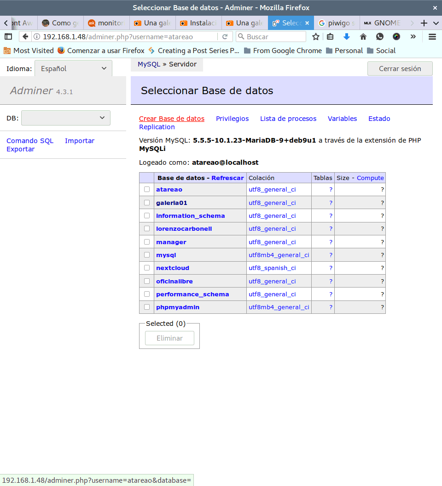
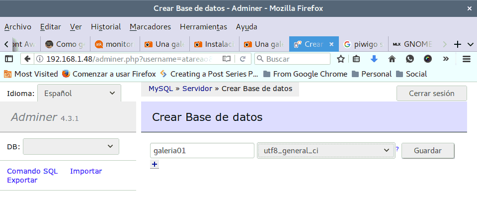
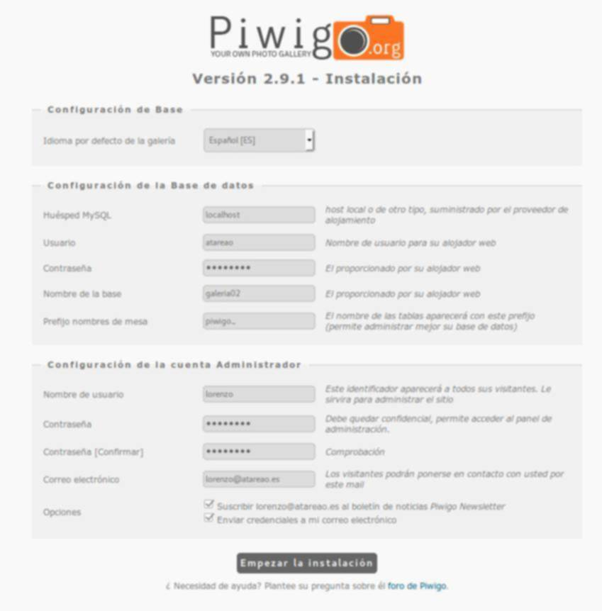
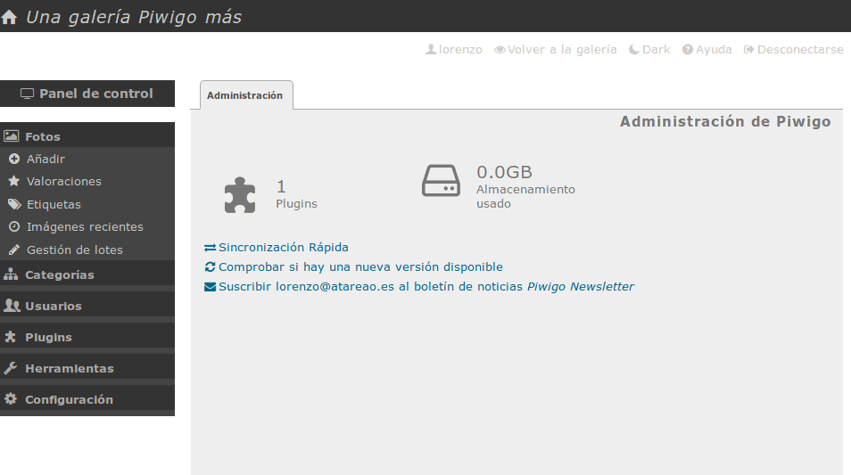
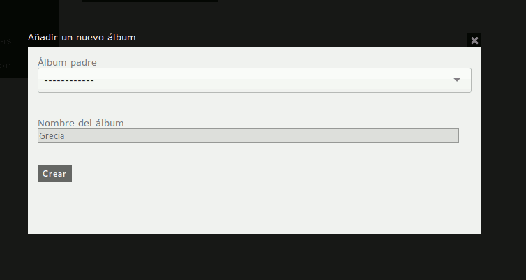
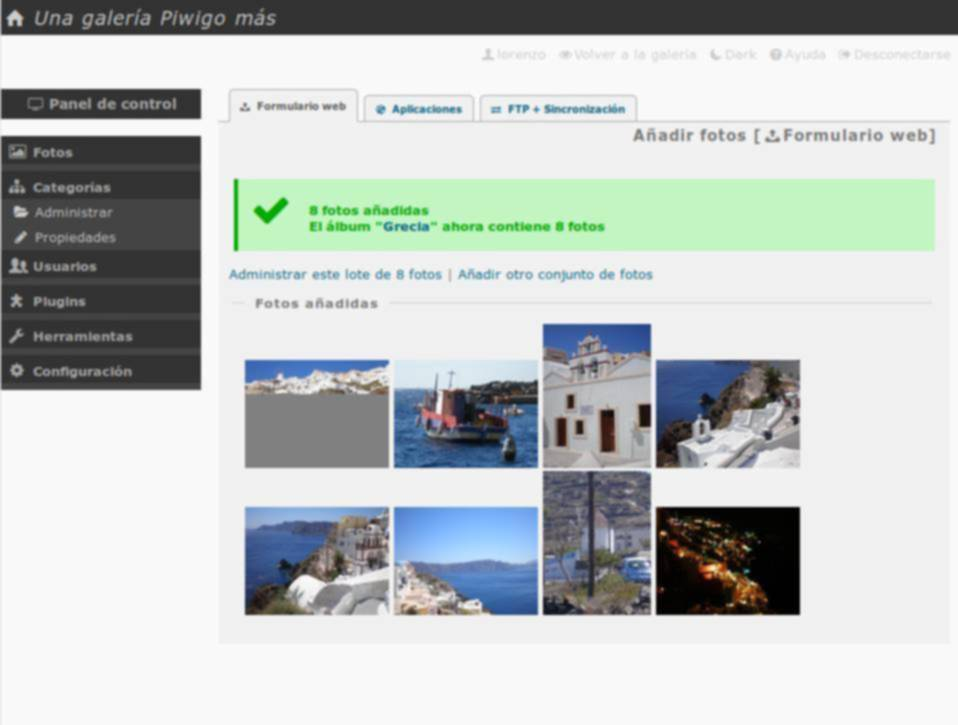
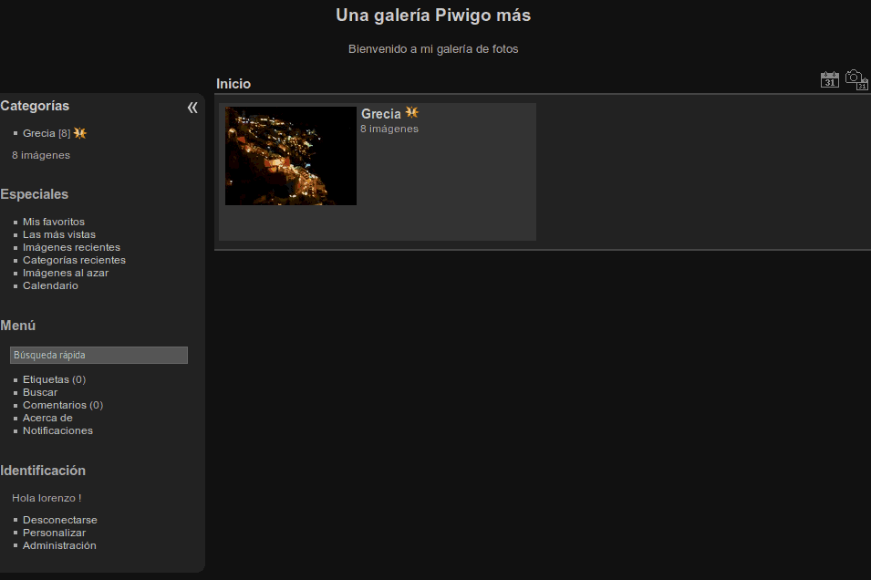

# Tu Galeria de Fotos Privada con Piwigo en tu Raspberry.

## Instalación.
### Lo podemos hacer desde el terminal,ejecutando las siguientes ordenes:

* cd /var/www/html
* wget -O piwigo.zip http://piwigo.org/download/dlcounter.php?code=latest
* unzip piwigo.zip
* sudo chown -R www-data:www-data
* sudo find piwigo -type f -exec chmod 664 {} \;
* sudo find piwigo -type d -exec chmod 775 {} \;

### Para el siguiente paso, es crear una base de datos que utilizaremos con Piwigo, para ello procedo a intalar Adminer atraves de las siguientes ordenes:

* cd /var/www/html
* sudo wget -O adminer.php https://www.adminer.org/latest.php
* sudo chown www-data:www-data adminer.php
* sudo 664 adminer.php

### Una vez terminado,tan solo tienes que abrir el navegador y poner la direccion 10.101.3.200/adminer.php, te logueas con el usuario:pi, y la contraseña:raspberry200, a continuacion creas una base de datos nueva con el nombre Piwigo, la colocacion deberá ser utf8_general_ci y guardamos.

### Toca ahora instalar Piwigo para ello entramos en la siguiente direccion: 10.101.3.200/piwigo/installl.php, una vez allí tendremos que completar los datos de configuracion, que seran los siguientes:

* Idioma por defecto --> Español.
* Usuario de la Base de Datos --> pi.
* Contraseña de la Base de Datos -->raspberry200.
* Nombre de Usuario --> tania.
* Contraseña --> 1234
* Correo electrónico --> tanialinares@iespobra.com

### Pulsamos el boton de empezar instalacion, y una vez hecho esto, si todo fue bien, te encontraras con el Panel de control de Piwigo.

### Por otro lado, si vas a la página 10.101.3.200/piwigo/, verás que tienes una visita guiada para aprender a gestionar y trabajar con Piwigo. 
##Creamos un album  y añadimos alguna fotografía, una vez añadidas nos mostrará un mesaje con el resultado.

### Si volvemos de nuevo a la pagina de Piwigo, veremos la aplicacion funcionando perfectamente.

### Os dejo por aqui el link a mi galeria Piwigo: 
* http://10.101.3.200/piwigo/

